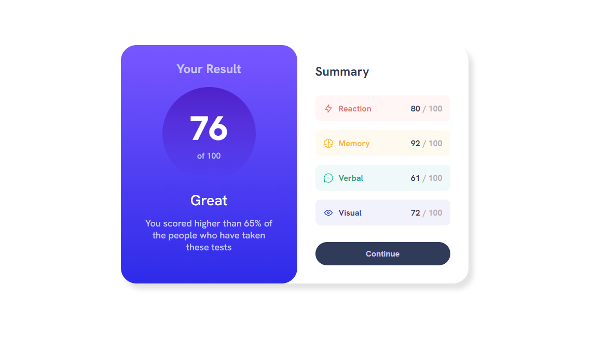

# Frontend Mentor - QR code component solution

This is a solution to the [QR code component challenge on Frontend Mentor](https://www.frontendmentor.io/challenges/results-summary-component-CE_K6s0maV). Frontend Mentor challenges help you improve your coding skills by building realistic projects.

## Table of contents

-   [Overview](#overview)
    -   [Screenshot](#screenshot)
    -   [Links](#links)
    -   [Built with](#built-with)
-   [Author](#author)
-   [Acknowledgments](#acknowledgments)

## Overview

QR frontend challenge from Frontend Mentor

### Screenshot

### Links

-   Solution URL: [Solution](https://github.com/NataJenkins/results-summary-component)
-   Live Site URL: [live site URL here](https://dashing-monstera-ceed48.netlify.app)

### Built with

-   Semantic HTML5 markup
-   CSS custom properties
-   Flexbox
-   Mobile-first workflow
-   [React](https://reactjs.org/) - JS library

## Author

-   Github - [NataJenkins](https://github.com/NataJenkins)
-   Frontend Mentor - [@NataJenkins](https://www.frontendmentor.io/profile/NataJenkins)
-   Linkedin - [natalia0896](https://www.linkedin.com/in/natalia0896/)
